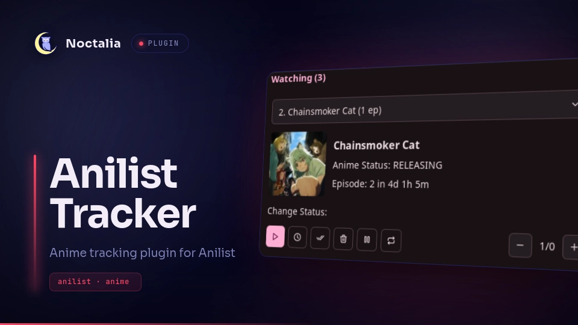

# Anilist Tracker



An [AniList](https://anilist.co) anime tracking plugin for [Noctalia](https://github.com/noctalia-dev). Browse your lists, view cover art and airing info, and update your progress or status without leaving your desktop.

## Features

- Browse all six AniList list statuses: Watching, Planning, Completed, Repeating, Paused, and Dropped
- Cover art fetched and cached locally for each entry
- Live countdown to the next airing episode for currently releasing anime
- Increment or decrement episode progress with a click, synced straight to your AniList profile
- Move an entry between statuses (e.g. Watching → Completed) directly from the panel
- Remembers your last selected tab and entry between sessions

## Requirements

- Noctalia `>= 5.0.0`
- An AniList account and a [Personal Access Token](https://anilist.co/settings/developer)

## Installation

1. Copy the plugin folder into your Noctalia plugins directory located at ~/.local/share/noctalia/plugins/
2. Reload Noctalia (or restart it) so the widget is picked up.
3. Add the **Anilist Tracker** widget to your bar.

## Setup

1. Generate a Personal Access Token from your [AniList Developer settings](https://anilist.co/settings/developer).
2. Middle-click the widget icon, or open its settings, and paste the token into the **AniList Access Token** field.
3. Click the widget to open the panel — your lists will sync automatically.
4. With your Client ID from step 1, open the following URL in your browser (replace `YOUR_CLIENT_ID`):
   ```
   https://anilist.co/api/v2/oauth/authorize?client_id=YOUR_CLIENT_ID&response_type=token
   ```
## Usage

- Click the bar widget to open the tracker panel.
- Use the top dropdown to switch between list statuses.
- Use the entry dropdown to pick a specific anime within that list.
- Use the **+ / −** buttons to update episode progress.
- Use the status buttons (Watching, Planning, Completed, Dropped, Paused, Repeating) to move the selected entry to a different list.
- Progress and status changes are pushed to your AniList profile in real time.

## Cover Cache

Cover images are downloaded and cached locally under:

```
$XDG_STATE_HOME/noctalia/anilist/covers
```

(defaults to `~/.local/state/noctalia/anilist/covers` if `XDG_STATE_HOME` isn't set).

