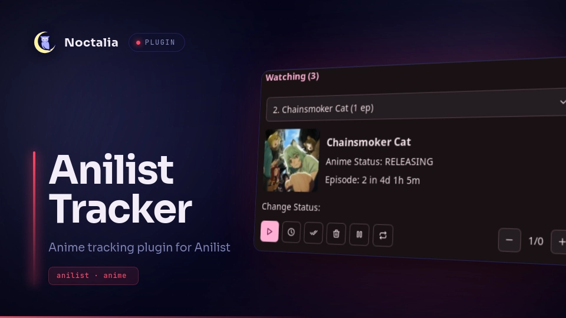

# Anilist Tracker



An [AniList](https://anilist.co) anime tracking plugin for [Noctalia](https://github.com/noctalia-dev). Browse your lists, view cover art and airing info, and update your progress or status without leaving your desktop.

## Features

- Browse all six AniList list statuses: Watching, Planning, Completed, Repeating, Paused, and Dropped
- Browse friends activity
- Cover art fetched and cached locally for each entry
- Live countdown to the next airing episode for currently releasing anime
- Increment or decrement episode progress with a click, synced straight to your AniList profile
- Move an entry between statuses (e.g. Watching → Completed) directly from the panel
- Remembers your last selected tab and entry between sessions
- Search AniList and open any anime's full page: info, description, genres, tags, rankings,
  characters with voice actors, relations, and recommendations
- Add anime to your list, change status, progress, and score, or favourite it, right from its page

## Requirements

- Noctalia `>= 5.0.0`
- An AniList account
- `python3` and `xdg-open` (used for the one-time browser login)

## Installation

1. In Noctalia's plugin settings, add this repository as a plugin source:
   `https://github.com/Edvvardas/anilist-noctalia-v5`
2. Find **Anilist Tracker** in the plugin list and click **Add to Noctalia**.
3. Add the **Anilist Tracker** widget to your bar.

## Setup

1. Click the widget to open the panel.
2. Click **Log in with AniList**. Your browser opens the AniList approval page.
3. Click **Approve**. The browser shows "Connected to AniList" and your lists load in the panel.

The login lasts about a year. When it expires the panel shows the login button again.
Use the log out button in the panel header to switch accounts.

Prefer not to use the browser login? Paste a token into the widget's **AniList Access Token**
setting instead.

## Usage

- Click the bar widget to open the tracker panel.
- Use the top dropdown to switch between list statuses.
- Use the entry dropdown to pick a specific anime within that list.
- Use the **+ / −** buttons to update episode progress.
- Use the status buttons (Watching, Planning, Completed, Dropped, Paused, Repeating) to move the selected entry to a different list.
- Progress and status changes are pushed to your AniList profile in real time.

## Cover Cache

Cover images are downloaded and cached locally under:

```
$XDG_STATE_HOME/noctalia/anilist/covers
```

(defaults to `~/.local/state/noctalia/anilist/covers` if `XDG_STATE_HOME` isn't set).

